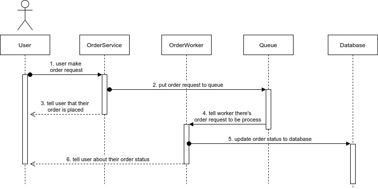

# Evermos - Backend Engineer Assessment
This project built with PHP Laravel Framework, you will need to make sure your server meet system requirement as described [here](https://laravel.com/docs/7.x#server-requirements)
## How to install
```
composer install
php artisan migrate:fresh --seed
```
## How to run
The simpliest way is using Laravel Local Development Server
```
php artisan serve
```
## How to play
### Rahman the tennis player
There's 2 endpoint for this solution
|endpoint  |method|description|
|----------|------|-----------|
|/api/container|GET|get list of Rahman's ball container|
|/api/container/put|POST|put ball to one of Rahman's ball container|

You will get 403 http status code when hitting `/api/container/put` endpoint when there's verified ball container on databases.

### Mom's Kitara Store
There's 4 endpoint for this solution
|endpoint  |method|description|
|----------|------|-----------|
|/api/product|GET|get list of products|
|/api/product/{id}/pessimisticOrder|POST|order product with pessimistic approach to handling race condition|
|/api/product/{id}/optimisticOrder|POST|order product with optimistic approach to handling race condition|
|/api/order|GET|get list of orders|

There's 2 approach I've implemeted to handling race condition when many order occurred for same product at a time.

1. Pessimistic Locking Approach
   
   The pessimistic locking approach is that the system assumes the worst, i.e., the updates always occur at the same time. Thus, it eliminates the race condition by locking the record. Pessimist systems typically rely on the database locking facilities; for example InnoDB’s row-level lock.

2. Optimistic Locking Approach
   
   The Optimistic locking approach is the the system assumes that although race conditions may occur, they are very rare. Therefore, instead of locking the record on every access, it looks for indications which denote the clients actually did try to update the record at the same time.

Pessimistic Locking Approach will be a nightmare if PHP script died due to fatal error or some other problem and the database left with the lock active. Optimistic Locking Approach will fail if system using concurency process to provide high performance API then there's order requests occurred between time less than 1 sec the system will assumes that order requests is valid requests.

3. Async Approach
   
   There other approach I am not implement here as another option to handling order race condition. Async approach is the system will queueing the order requests and tell user about their order status when process is done later. Below is sequence diagram to do this approach.

   
